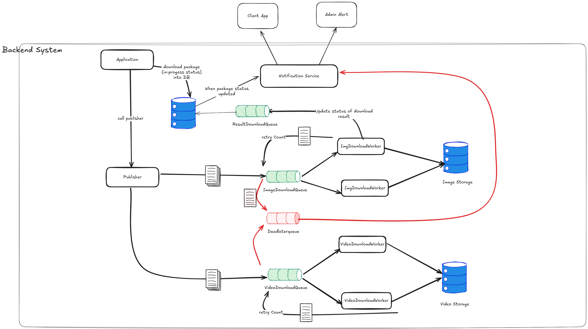

# Installation Documentation

## Prerequisites

Before setting up the project, ensure the following tools are installed on your system:

1. **Docker and Docker Compose**  
   - Install Docker: [https://docs.docker.com/get-docker/](https://docs.docker.com/get-docker/)  
   - Install Docker Compose: [https://docs.docker.com/compose/install/](https://docs.docker.com/compose/install/)

2. **Node.js 18+** (for local development)  
   - Download and install Node.js: [https://nodejs.org/](https://nodejs.org/)

3. **Git**  
   - Install Git: [https://git-scm.com/downloads](https://git-scm.com/downloads)

---

## Project Structure

The project consists of the following main components:

- **`frontend`**: A React-based client application running on **port 3000**.  
- **`publisher`**: An API server powered by Node.js and Express, running on **port 8000**.  
- **`worker`**: A background processing service for tasks like image processing or data handling.  
- **Database Services**:
  - **Redis**: For caching and message queuing.
  - **PostgreSQL**: For relational database storage.

Backend design 


---

## Installation Steps

--- To easy for install i've pushed .env without ignore for running project 

### 1. Clone the Repository
```bash
git clone https://github.com/your-repo-name.git
cd your-repo-name
```

### 2. Create mount volume log
```bash
mkdir -p ./app/logs
chmod 777 ./app/logs
```

### 3. Docker compose 
```bash
docker compose up -d
```

### 4. Access frontend Open your browser and navigate to:
http://localhost:3000

## Troubleshooting
### Common Issues
1. Permission denied for logs
```bash
    chmod 777 ./app/logs
```
2. Redis connection failed
    - Check Redis service is running
    - Verify REDIS_HOST and REDIS_PORT
3. Database connection failed
    - Check PostgreSQL service
    - Verify database credentials